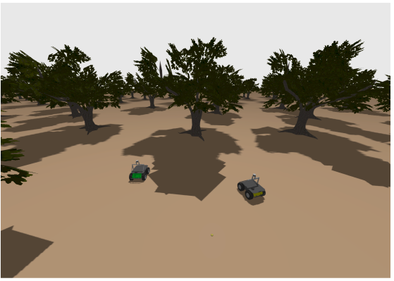

# OHMS-NetSim: Outdoor Heterogeneous Multi-Robot System Network Simulator

[](https://docs.ros.org/en/humble/index.html)
[](https://gazebosim.org/docs/fortress)
[](./LICENSE)

OHMS-NetSim is a high-fidelity simulation framework for developing and testing algorithms for Outdoor Heterogeneous Multi-Robot Systems. Built on ROS 2 Humble and Gazebo, it provides a realistic platform for researchers to validate navigation, communication, and coordination strategies in challenging outdoor environments.

The key feature of OHMS-NetSim is its custom Gazebo plugin that simulates realistic, obstacle-dependent communication degradation based on established scientific models, enabling the study of communication-aware robotics.



---

## Table of Contents
- [Key Features](#key-features)
- [Installation](#installation)
- [Getting Started and Tutorials](#getting-started)
- [Project Structure](#project-structure)
- [Community and Contribution](#community-and-contribution)
- [Citation](#citation)
- [Acknowledgements](#acknowledgements)

---

## Key Features

* **Heterogeneous Teams:** Simulate complex teams of Unmanned Ground Vehicles (UGVs) and Unmanned Aerial Vehicles (UAVs).
* **Realistic Outdoor Worlds:** Includes several pre-built environments, such as a marsyard and dense forests.
* **Modular Scenario Definition:** Easily define and launch complex multi-robot scenarios using a combination of YAML configuration files and ROS 2 launch files.
* **Scientifically-Grounded Comms Emulation:** A custom Gazebo plugin simulates path loss and packet drop rates based on peer-reviewed models, allowing for realistic testing of communication-aware algorithms.
* **ROS 2 Humble Integration:** Fully integrated with the ROS 2 ecosystem, providing a standard platform for robotics research and development.

---
## Getting Started and Tutorials

* **[Getting Started](./docs/GETTING_STARTED.md):** Tutorial to start a basic simulation.
* **Tutorials:**  
    - **Update Environment:** _TODO: Add step-by-step guide for simulating new Gazebo worlds._  
    - **Update Robot Models:** _TODO: Add step-by-step guide for customizing existing robot models or integrating new robots into the simulation._
---

## Project Structure

The repository is organised to allow for easy customisation and extension.

* `/launch`: Contains the top-level ROS 2 launch files for starting different simulation scenarios.
* `/config`: Holds the YAML files used to configure the parameters for each simulation, such as robot names, initial poses, and sensor loadouts.
* `/worlds`: Contains the Gazebo `.sdf` world files.
* `/models`: Contains the Gazebo `.sdf` model files for the robots and other objects in the world.
* `/src`: Contains the C++ source code for the `CommsEmulatorHelper` Gazebo plugin.
* `/docs`: Contains detailed project documentation.

To create a new scenario, you can create a new YAML file in the `/config` directory and a corresponding launch file in the `/launch` directory.

---

## Community and Contribution

We welcome contributions from the community! Whether you are reporting a bug, suggesting a new feature, or submitting code, your input is valuable. Please consult our community guidelines to get started.

* **[Project Roadmap](./docs/ROADMAP.md):** Outlines our phased release plan, from the current prototype to future stable versions.
* **[Contribution Guidelines](./CONTRIBUTING.md):** Explains how to contribute to the project.
* **[Code of Conduct](./CODE_OF_CONDUCT.md):** Our commitment to a welcoming and inclusive community.

---

## Citation

If you use OHMS-NetSim in your research, please cite our work.

```bibtex
@inproceedings{boralessa-2025-ohmsnetsim,
  title     = {OHMS‑NetSim: Enabling Obstacle‑Aware Network‑Physics Co-Simulation for Outdoor Multi‑Robot Applications},
  author    = {Kalhan Boralessa, David Adama, Ahmad Lotfi, and João Filipe Ferreira},
  booktitle = {UKCI},
  year      = {2025},
  address   = {Edinburg, UK}
}
```

---

## Acknowledgements

The simulation worlds `marsyard2020`, `marsyard2020forest`, and `marsyard2020forest5x` are adapted from the [leo_simulator-ros2](https://github.com/LeoRover/leo_simulator-ros2) package, developed by the Mars Society Polska and the Leo Rover team. We extend our gratitude for their excellent work.

---
